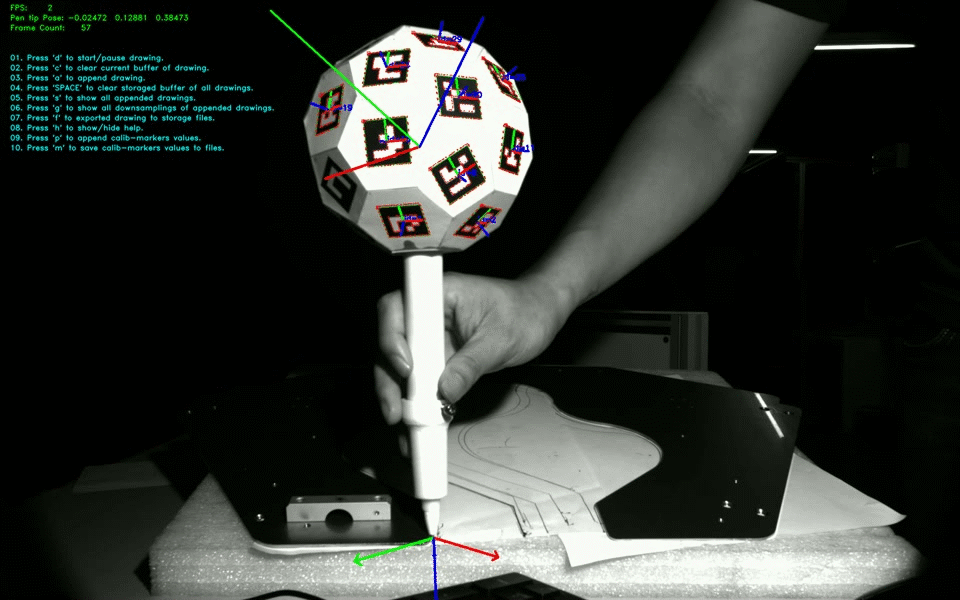
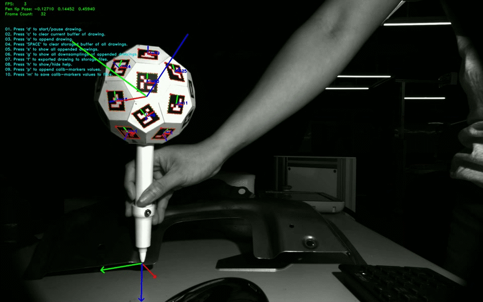
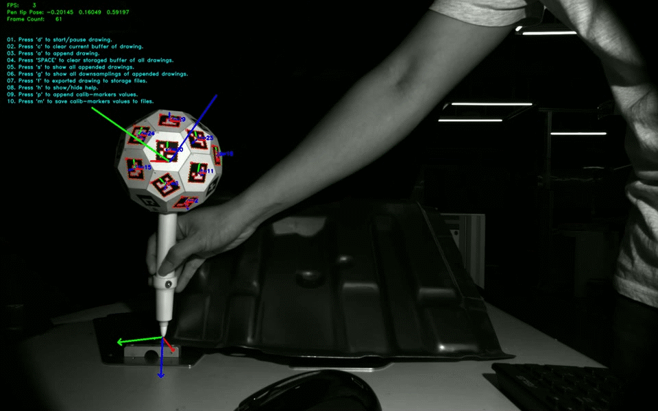
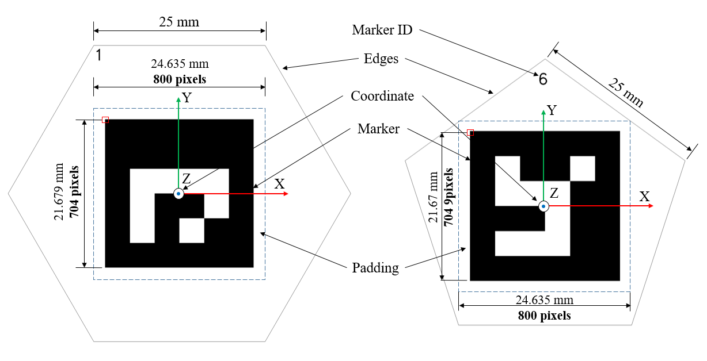
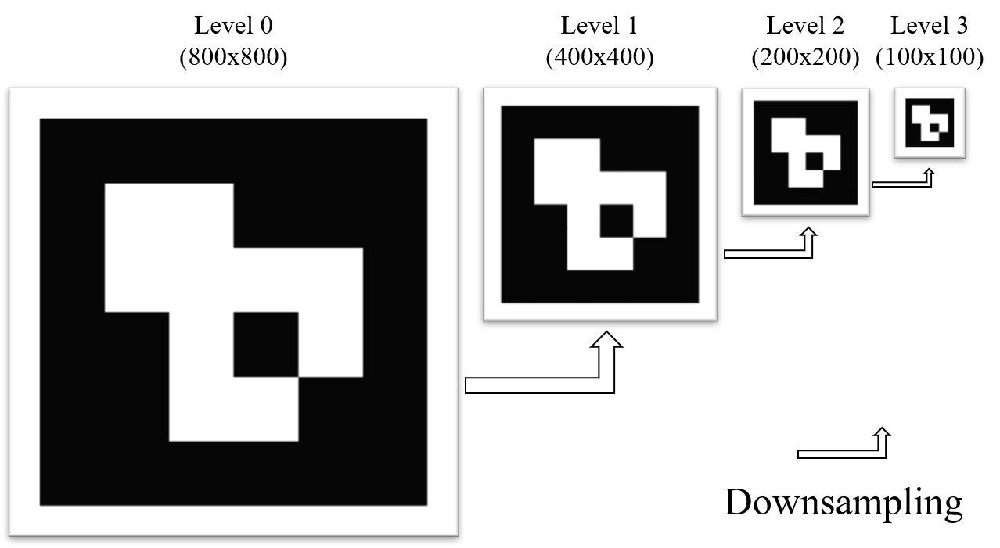
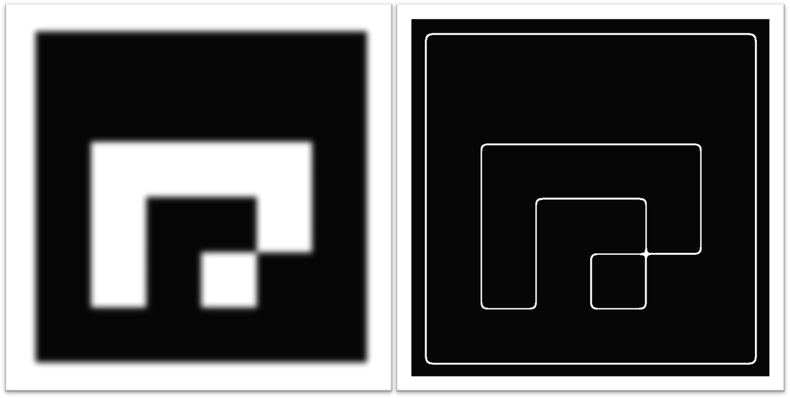
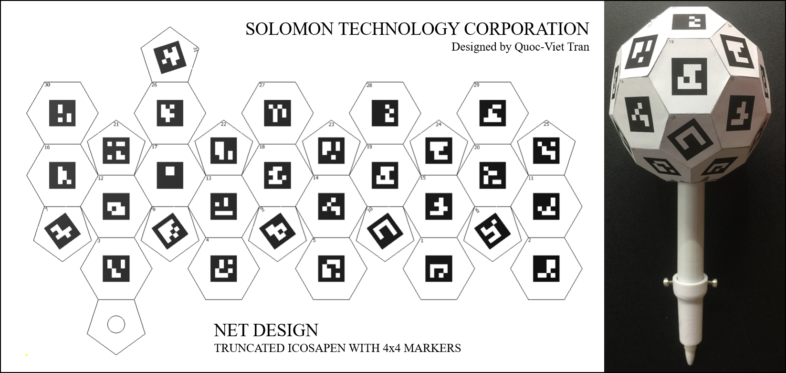
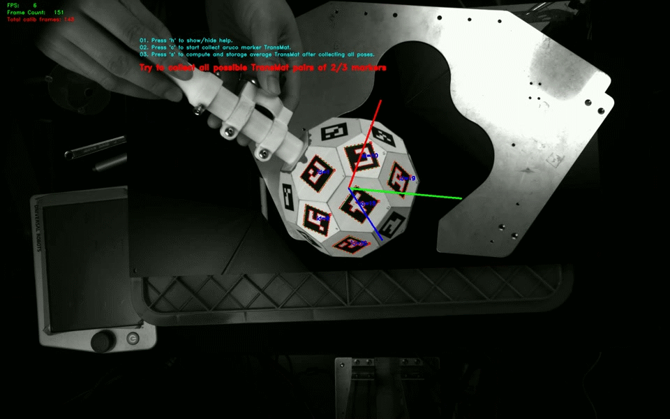
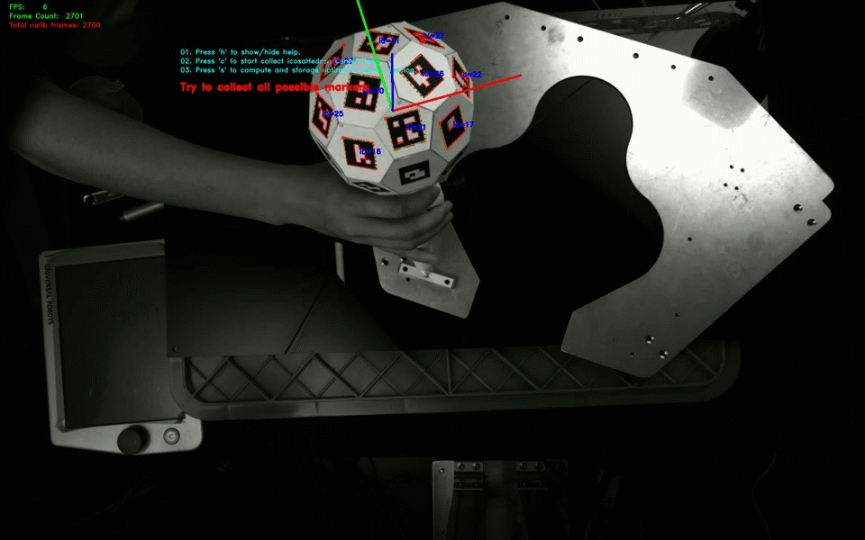

# Optimized_Solpen

This repo tries to improve the fps of the original Icosahedron pen repo.

The highest fps is 24, which was tested on Ubuntu 20.04, Ryzen 9, 4.7Ghz, Ram 64 GB.

## Requirements

Python 3.8 or later with all [requirements.txt](requirements.txt) dependencies installed. To install run:

```bash
$ pip install -r requirements.txt
```
## Video Link

- Download videos for geometry and pentip calibration [here](https://drive.google.com/drive/folders/1MSVv2j8kXaLwg30mbI86w1IobN-X_CCI?usp=sharing).
- For running inference, try to download some videos from this [link](https://drive.google.com/drive/folders/1Xmp3AOIYUylGv2o7y9UJQY0Fh3u5WREw?usp=sharing).

## Configuration

Open `./config/config.py` to setup all neccessary params.
Remember to modify the video name for processing.


## Run inference

To achieve better fps, try to configurate ```config.py```

```
  self.online_Calib           = False
  self.write_Video            = False
  self.display_windows_scaled = 0.75
  self.drawingMarkerAxes      = False
  self.threadn                = 4
  self.thresDistLengthWidth   = 1.2
  self.num_edge_points        = 20
```

**Tips**: 
- To improve the accuracy, try to maximize the ```self.num_edge_points``` param, eg. 180, to increase the number of edge samples of detected aruco markers. However, the fps will be declined.
- To detect more markers, try to set higher param ```self.thresDistLengthWidth```, eg. 2.0. The fps is also declined.

**Run inference**:

```python3 06_Drawing_Demo_async_parallel.py```

**During running inference, press keyboard to set actions**:
- Press 'h' to show/hide help menu.
- Press 'd' to start collect new drawing pose paths.
- Press 'a' to append drawing pose path to a list.
- Press 'c' to clear current buffer of drawing.
- Press 's' to show all appended drawings."
- Press 'g' to show all downsamplings of appended drawings.
- Press 'f' to export all drawing pose paths to storage files.
- Press 'SPACE' to clear storaged buffer of all drawings.

**Drawing demo:**

<p align="center">
  
  <br/>
  <b>Fig. 1. </b> Sample results
</p>

## Solpen Application for welding task:

<p align="center">
  
  <br/>
  <b>Fig. 2. </b>Guiding Robot UR5
</p>

# Building from scratch

### 01. Generate pyramidal images and edge samples of 31 Aruco markers (ID 1~31) for the designed Icosahedron surfaces.

- In this project, the Aruco markers are designed to fit at the centers of two polygons (Pentagon and Hexagon) as shown in Fig.3 belows:

<p align="center">
    
</p>

<p align="center"> <b>Fig.3. </b> Aruco markers with polygon border. </p>  

- 31 Aruco markers are first processed with the pyramid technique and contour extraction to get pairs of corresponding 2d-3D samples at the edges of markers. 
Four pyramidal levels are used in our setting. The resolutions of marker are 800x800, 400x400, 200x200, and 100x100 as shown in <b>Fig.4.</b>, the highest resolution represents for closest distance, while the lower resolutions represent for further distances.

<p align="center">
    
</p>

<p align="center"> <b>Fig.4. </b> Four-level pyramidal images. </p>

- Edge pixels of each Aruco marker are extracted by analyzing the fourth level pyramidal images (resolution 100x100) with the grayscale range fromm 100~160. All position of 2D edge samples are collected and the corresponding 3D coordinates are computed as shown in <b>Fig.5.</b>

<p align="center">
    
</p>

<p align="center"> <b>Fig.5. </b> Aruco marker and the corresponding edge pixels. </p>

- To generate contour dataset (pairs of 2d-3D) for 31 Aruco markers, run:
```
    python3 01_gen_2D_3D_Edge_Points_Markers.py
```

By default config, data will be saved to:
```
    gen_Data/gen_Markers_Pyramids
    gen_Data/thick_edge_coord_pixels
    gen_Data/thick_edge_coord_R3
```

### 02. Define center and orientation of 31 markers, initilize rotation and translations vectors from each Aruco surface to center of Icosahedron.

Run:
```
    python3 02_Plot_IcosaHedron.py
```

The truncated IcosaHedron  geometry is constructed from Icosahedron  with the 12 vertices truncated such that one-third of each edge is trimmed at each of both ends. It generates a polyhedron consisting of 32 surfaces (12 pentagonal and 20 hexagonal faces), 60 vertices, and 90 edges. The coordinate of the truncated icosahedron is defined at the center and vertices are a combination of 3D points belonging to the orthogonal rectangles (0,±1,±3φ), (±1,±3φ,0), (±3φ,0,±1) and the orthogonal cuboids (±2,±(1+2φ),±φ), (±(1+2φ),±φ,±2), (±φ,±2,±(1+2φ)) along with the orthogonal cuboids (±1,±(2+φ),±2φ), (±(2+φ),±2φ,±1), (±2φ,±1,±(2+φ)), where φ = (1+√5)/2 is the golden mean. Using φ2 = φ + 1 one verifies that all vertices are on a sphere, centered at the origin, with the radius squared equal to 9φ + 10. The edges have a length of 2. We scale edge length into 25 mm for the proposed truncated Icosapen design as shown in <b>Fig. 6</b>.

<p align="center">
    
</p>

<p align="center"> <b>Fig.6. </b> Define Aruco markers and initialize rotation and translation vectors to center of Icosahedron. </p>


### 03. Generate 31 Aruco markers with Polygon border and design the Solpen.

- Firstly, run ```03_Gen_Markers_With_Polygon.py``` to generate 31 Aruco markers with polygon border as shown in <b>Fig.3</b>.
- Next, try to stick all markers follwing the Net design as shown in <b>Fig.7 </b> belows:

<p align="center">
    
</p>

<p align="center"> <b>Fig.7. </b> Net design for Solpen. </p>

### 04. Geometry calibration for Solpen.

Bundle adjustment is implemented to optimize transformations from the Solpen Aruco surfaces to the center so that the averaging reprojection error is minimized. APE and DPR are two approaches used to optimize 31 transformation matrices from Icosahedron surfaces to center.

To calibrate geometry of Solpen, try to rotate the pen around to collect all possible views of markers as shown in <b>Fig. 8 </b>. The recommended distance for geometry calibration is around 50cm.

<p align="center">
    
</p>

<p align="center"> <b>Fig. 8. </b> Geometry calibration. </p>

Run 
```
    python3 04_Geometry_Calib_async_parallel.py
```

### 05. Pentip calibration for Solpen.

To identify the transformation vector from center of Solpen to the tip, we rotate the pen around while fix the tip position as shown in <b>Fig. 9 </b>. The RANSAC algorithm is then applied to find out the optimized pentip position from collected 3D positions of Solpen which are desired to lie on spherical surfaces.

<p align="center">
    
</p>

<p align="center"> <b>Fig.9. </b> Pentip calibration. </p>

Run 

```
    python3 05_Pentip_Calib_async_parallel.py
```
